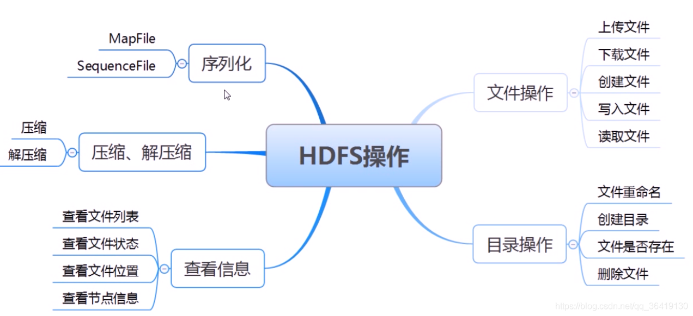

# Hadoop javaAPI实现


# HDFS 文件系统Java API 简单代码实现




之前我们对hdfs的操作主要是通过在linux命令行里进行的，而在实际的应用中，为了实现本地与HDFS 的文件传输，我们主要借助于eclipse的开发环境开发的javaAPI来实现对远程HDFS的文件创建，上传，下载和删除等操作

Hadoop中关于文件操作类基本上全部是在"org.apache.hadoop.fs"包中，Hadoop类库中最终面向用户提供的接口类是FileSystem，该类封装了几乎所有的文件操作，例如CopyToLocalFile、CopyFromLocalFile、mkdir及delete等。综上基本上可以得出操作文件的程序库框架：

## 新建文件夹

```java
GetMapping("/mkdir")
public String mkdir(@RequestParam(value = "") String path) throws IOException, URISyntaxException {
        Configuration conf = new Configuration();
        String hdfsPath = "hdfs://localhost:8020";
        FileSystem hdfs = FileSystem.get(new URI(hdfsPath), conf);
        String newDir = "/home/"+path;
        System.out.println("创建路径："+newDir);
        boolean result = hdfs.mkdirs(new Path(newDir));
        if (result) {
            System.out.println("Success!");
            return "Success!";
        }else {
            System.out.println("Failed!");
            return "Failed!";
        }

    }
```

## 新建文件

```java
@GetMapping("/touchFile")
public String touchFile(@RequestParam(value = "") String name) throws IOException, URISyntaxException {
        Configuration configuration = new Configuration();

        String hdfsPath = "hdfs://localhost:8020";
        FileSystem hdfs = FileSystem.get(new URI(hdfsPath), configuration);

        String filePath = "/home/"+name;

        FSDataOutputStream create = hdfs.create(new Path(filePath));

        System.out.println("Finish!");

        return "新建文件："+name;
    }
```

## 把本地文件上传到本地文件系统

```java
@GetMapping("/copyFromLocalFile")
public String copyFromLocalFile(@RequestParam(value = "") String path) throws IOException, URISyntaxException {
        Configuration conf = new Configuration();
        String hdfsPath = "hdfs://localhost:8020";
        FileSystem hdfs = FileSystem.get(new URI(hdfsPath), conf);
        String from_Linux = "D:/Dev/hadoop/home/hadoop-2.10.1/etc/靓仔.txt";
        String to_HDFS = "/home/";
        hdfs.copyFromLocalFile(new Path(from_Linux), new Path(to_HDFS));
        System.out.println("Finish!");
        return "上传成功："+path;
    }
```

## 将HDFS文件系统上的文件下载到本地

```java
 @GetMapping("/down")
 public String down(@RequestParam(value = "") String path) throws IOException,  URISyntaxException {
        Configuration conf = new Configuration();
        String hdfsPath = "hdfs://hadoop.aikezc.com:8020";
        FileSystem hdfs = FileSystem.get(new URI(hdfsPath), conf);
        String from_HDFS = "/home/靓仔.txt";
        String to_Linux = "D:\\Dev\\hadoop\\home\\hadoop-2.10.1\\etc";
        hdfs.copyToLocalFile(false, new Path(from_HDFS), new Path(to_Linux));
        System.out.println("Finish!");
        return "下载："+path;
    }
```

## 列出HDFS文件系统某个目录下，所有的文件

```java
 @GetMapping("/list")
 public String list(@RequestParam(value = "") String path) throws IOException,  URISyntaxException {
        Configuration conf = new Configuration();
        String hdfspath = "hdfs://localhost:8020";
        FileSystem hdfs = FileSystem.get(URI.create(hdfspath), conf);
        String watchHDFS = "/"+path;
        iteratorListFile(hdfs, new Path(watchHDFS));
        return "YYY";
    }
 public static void iteratorListFile(FileSystem hdfs, Path path)
            throws FileNotFoundException, IOException {
        FileStatus[] files = hdfs.listStatus(path);
        for (FileStatus file : files) {
            if (file.isDirectory()) {
                System.out.println(file.getPermission() + " " + file.getOwner()
                        + " " + file.getGroup() + " " + file.getPath());
                iteratorListFile(hdfs, file.getPath());
            } else if (file.isFile()) {
                System.out.println(file.getPermission() + " " + file.getOwner()
                        + " " + file.getGroup() + " " + file.getPath());
            }
        }
    }
```

## 在HDFS上，创建文件并在文件中写入内容。

```java
@GetMapping("/write")
public String write(@RequestParam(value = "") String path) throws IOException, URISyntaxException {
        Configuration conf = new Configuration();

        String hdfsPath = "hdfs://hadoop.aikezc.com:8020";
        FileSystem hdfs = FileSystem.get(URI.create(hdfsPath), conf);

        String filePath = "/home/靓仔.txt";

        FSDataOutputStream create = hdfs.create(new Path(filePath));

        System.out.println("Step 1 Finish!");

        String sayHi = path;
        byte[] buff = sayHi.getBytes();
        create.write(buff, 0, buff.length);
        create.close();
        System.out.println("Step 2 Finish!");

        return path;
    }
```

